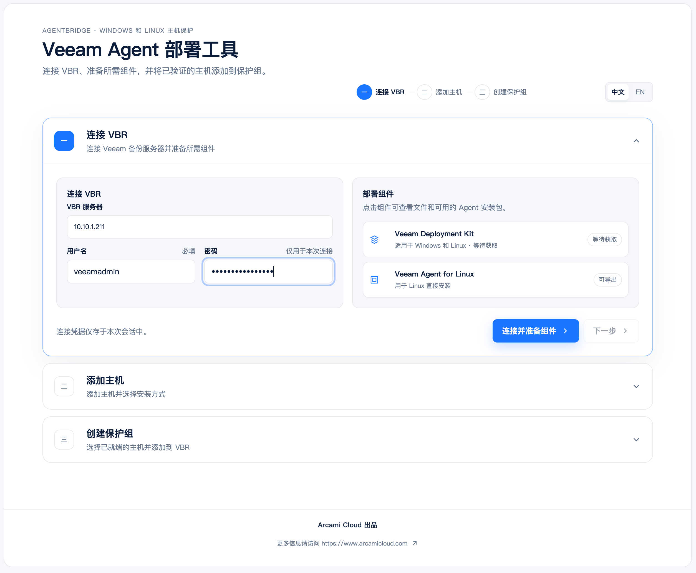
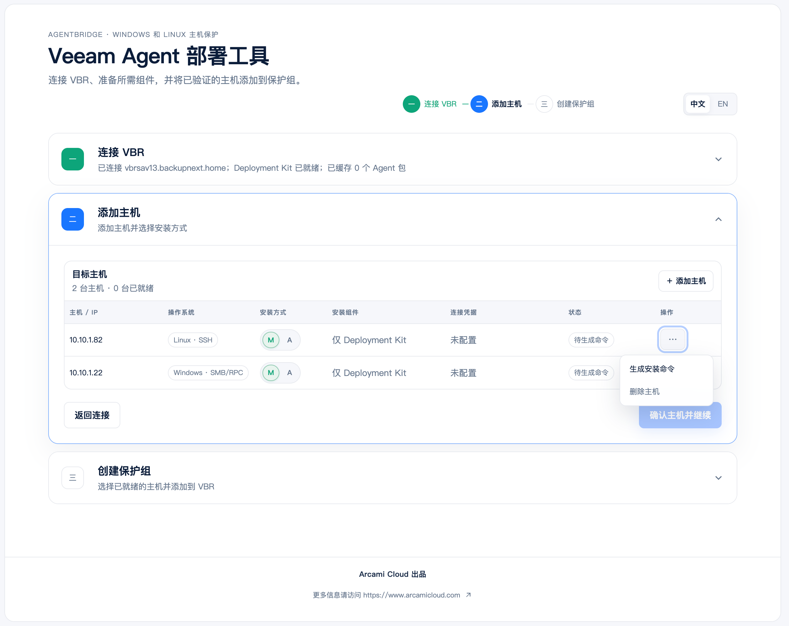
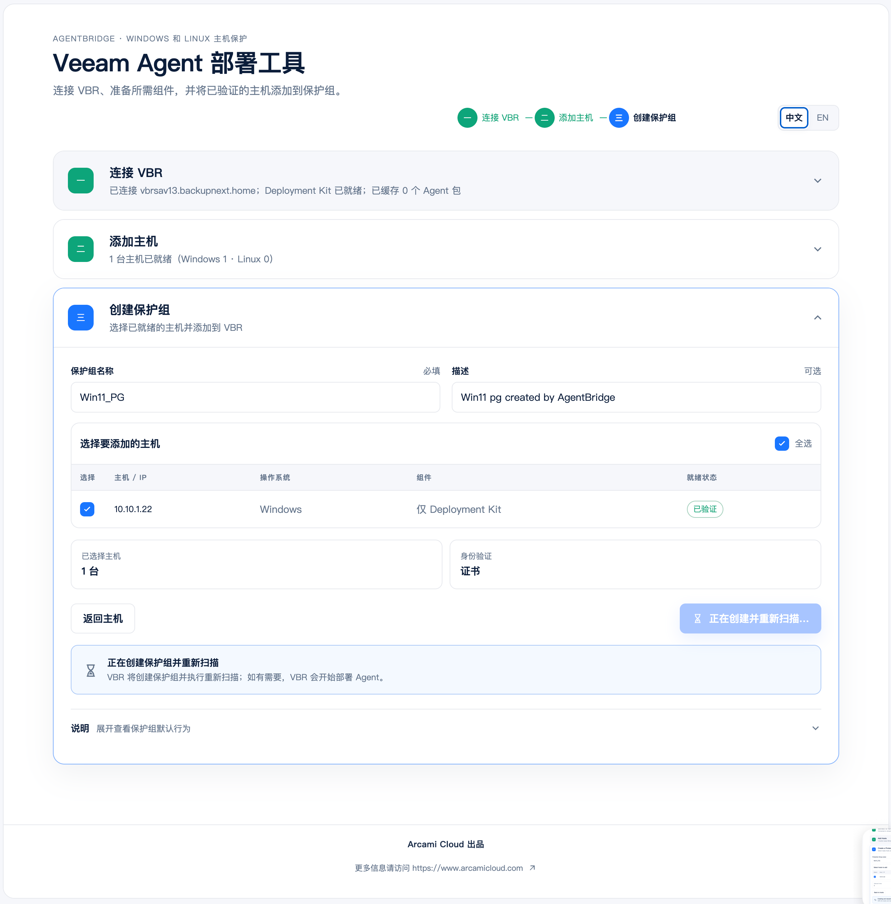

<p align="center">
  
</p>

<h1 align="center">AgentBridge</h1>

<p align="center"><strong>Bootstrap once. Trust by certificate. Manage with Veeam.</strong></p>

<p align="center">
  <a href="README.md">English</a> · 简体中文
</p>

---

## AgentBridge 是什么？

AgentBridge 是一款面向 Veeam Backup & Replication（VBR）的跨平台首次部署与纳管工具。它是可直接运行的独立应用，支持在 Windows、Linux 或 macOS 管理终端上使用，不要求安装服务或额外运行环境。

它帮助备份管理员将 **Windows 和 Linux 主机**安全地接入 VBR：在需要时部署 Veeam Deployment Kit；在 Linux 上可按系统实际情况预装匹配的 Veeam Agent；随后创建基于证书的 Protection Group，让 VBR 接管后续的发现与 Agent 管理。

它只负责“第一次可靠地接上”。备份策略、日常备份、升级、恢复和长期生命周期管理仍然属于 VBR。

## 为什么使用 AgentBridge？

| 能力 | 说明 |
|---|---|
| **跨平台运行** | Windows、Linux、macOS 均可使用；启动后在浏览器中完成全部操作。 |
| **支持混合环境** | 在同一个流程中准备 Windows 与 Linux 主机，并将它们加入同一个证书认证的保护组。 |
| **凭据不落盘** | SSH、Windows 管理员与 VBR 登录凭据只用于当前操作，不保存为长期凭据。 |
| **部署前验证** | Linux 会探测系统并匹配安装包；Windows 会测试远程安装条件。 |
| **组件来自 VBR** | Deployment Kit 与 Linux Agent 安装包均从用户自己的 VBR 获取。 |
| **手工或自动安装** | 支持远程自动部署，也可生成一次性手工安装命令。 |
| **清晰展示结果** | 本地安装、保护组创建和 VBR 发现结果分别展示，便于排查问题。 |

## 当前支持

| 目标主机 | AgentBridge 执行的工作 | 方式 |
|---|---|---|
| Linux | 安装 Deployment Kit，或 Agent + Deployment Kit | SSH 远程安装；手工安装命令 |
| Windows | 安装 **Deployment Kit** | 远程自动安装；手工安装命令 |

Windows 上的 Veeam Agent 由 VBR 在 Protection Group 扫描后按 VBR 配置部署；AgentBridge 当前不直接为 Windows 选择或安装 Agent 包。

## 开始前

准备好以下内容：

- 可访问的 **Veeam Backup & Replication v13.1** 环境；
- 将运行 AgentBridge 的 Windows、Linux 或 macOS 管理终端；
- Linux 的 SSH 访问权限，或一位可在目标机本地执行安装的 Linux 管理员；
- Windows 的管理员帐户，以及到目标主机 TCP/445、`ADMIN$` 和 Task Scheduler RPC 的访问权限；
- VBR 能够在后续扫描阶段访问目标主机的网络路径。

## 三步上手

1. 从 [Releases](https://github.com/Coku2015/AgentBridge/releases) 下载适用于当前管理终端的 AgentBridge，然后直接运行：

   ```bash
   agentbridge
   ```

   AgentBridge 启动后会自动打开本机 Web 控制台。如浏览器没有自动打开，请访问终端中显示的地址。诊断日志保存在 `data/logs/agentbridge.log`。

2. 在控制台中连接 VBR。AgentBridge 会在首次连接时固定服务器证书，然后生成或导入 Deployment Kit。

3. 添加主机并完成部署：

   - **Linux**：测试连接凭据；需要安装 Agent 时确认推荐配置，然后安装 Deployment Kit 或 Agent + Deployment Kit；
   - **Windows**：测试管理员凭据并安装 Deployment Kit，或复制手工安装命令到目标机执行；
   - 选择已就绪的主机，创建基于证书的 `Individual Computers` 类型保护组，并等待 VBR 完成扫描。

## 界面流程

### 1. 连接 VBR 并准备部署组件



### 2. 添加 Windows 和 Linux 主机



### 3. 创建基于证书的 Protection Group



## 部署方式选择

| 场景 | 推荐方式 |
|---|---|
| 备份管理员可临时访问 Linux | SSH 远程部署 |
| Linux 团队不共享 SSH/root 凭据 | 生成手工安装命令，由 Linux 管理员执行 |
| Windows 管理员共享可用，且网络允许 SMB/RPC | Windows 远程部署 |
| Windows 不允许远程管理共享或 Remote UAC 阻断 | 生成短时手工安装命令，由目标机管理员执行 |

## 使用边界

- AgentBridge 不替代 VBR：不创建备份作业，不执行恢复，也不管理长期 Agent 生命周期。
- 非官方支持的 Linux 发行版可能得到兼容性推荐，但这不等同于 Veeam 官方支持；请先在实验环境完成验证。
- 重新生成 Deployment Kit 会使尚未使用的旧 Kit 失效。大批量部署前请统一准备安装文件。
- Windows 与 Linux 的“本地安装成功”和“VBR 已发现”是两个独立结果；请以控制台的分层状态为准。

## 获取帮助与参与

欢迎通过 GitHub Issues 提交问题、使用场景和改进建议。提交问题时，请提供已脱敏的错误信息、目标平台、VBR 版本和复现步骤；请勿提交密码、私钥、Token 或 Deployment Kit 内容。
