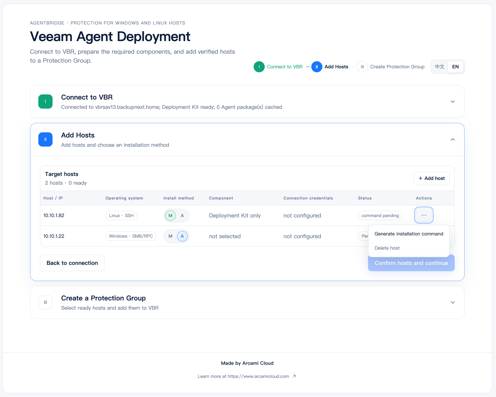
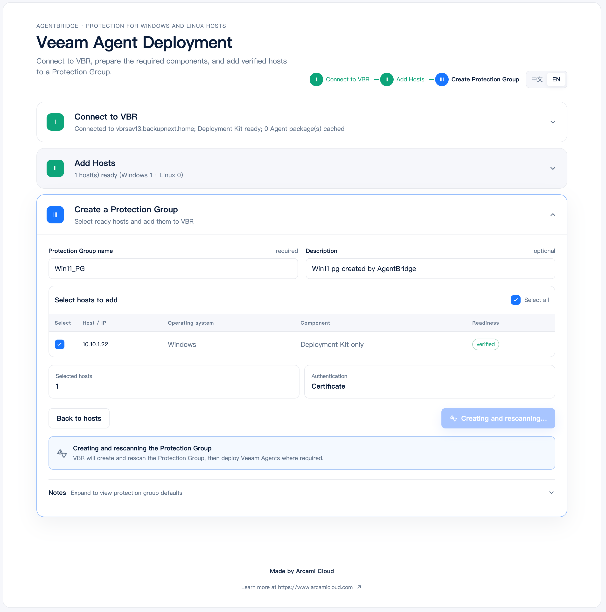

<p align="center">
  
</p>

<h1 align="center">AgentBridge</h1>

<p align="center"><strong>Bootstrap once. Trust by certificate. Manage with Veeam.</strong></p>

<p align="center">
  English · <a href="README-CN.md">简体中文</a>
</p>

---

## What is AgentBridge?

AgentBridge is an open-source, cross-platform bootstrap and enrollment tool for **Veeam Backup & Replication (VBR)**. Run one self-contained application directly on your Windows, Linux, or macOS management machine—no service installation or external runtime required.

It helps backup teams bring **Windows and Linux hosts** into VBR safely: deploy the Veeam Deployment Kit where needed, optionally pre-install a matched Veeam Agent on Linux, then create a certificate-based Protection Group for VBR discovery and ongoing management.

AgentBridge handles the first trusted connection. Backup policies, scheduled backups, upgrades, restores, and long-term lifecycle management remain with VBR.

## Why AgentBridge?

| Capability | What it means |
|---|---|
| **Cross-platform** | Run AgentBridge on Windows, Linux, or macOS and complete the workflow in a browser. |
| **Mixed environments** | Prepare Windows and Linux hosts together and add them to one certificate-based Protection Group. |
| **No stored credentials** | SSH, Windows administrator, and VBR credentials are used only for the active operation. |
| **Pre-deployment checks** | AgentBridge probes Linux systems, matches packages, and tests Windows remote-install requirements. |
| **Components from your VBR** | Deployment Kits and Linux Agent packages are obtained from the user's own VBR server. |
| **Manual or automatic installation** | Deploy remotely or generate a one-time manual installation command. |
| **Clear results** | Local installation, Protection Group creation, and VBR discovery are reported separately. |

## Supported today

| Endpoint | What AgentBridge deploys | Methods |
|---|---|---|
| Linux | Deployment Kit, or Agent + Deployment Kit | Remote SSH installation; manual installation command |
| Windows | **Deployment Kit** | Remote installation; manual installation command |

On Windows, VBR deploys the Veeam Agent according to the Protection Group configuration after the rescan. AgentBridge does not currently select or install Windows Agent packages directly.

## Before you begin

You will need:

- A reachable **Veeam Backup & Replication v13.1** environment;
- A Windows, Linux, or macOS machine to run AgentBridge;
- SSH access to Linux, or a Linux administrator who can run the manual install locally;
- A Windows administrator account and access to TCP/445, `ADMIN$`, and Task Scheduler RPC for remote Windows deployment;
- Network connectivity from VBR to the endpoints for the later rescan stage.

## Quick start

1. Download AgentBridge for your management machine from [Releases](https://github.com/Coku2015/AgentBridge/releases), then run it:

   ```bash
   agentbridge
   ```

   AgentBridge opens the local Web Console automatically. If the browser does not open, visit the address shown in the terminal. Diagnostic logs are stored in `data/logs/agentbridge.log`.

2. Connect to VBR in the console. AgentBridge pins the server certificate on first use, then generates or imports a Deployment Kit.

3. Add hosts and deploy:

   - **Linux** — test the credentials, confirm the recommended Agent profile when required, then install the Deployment Kit or Agent + Deployment Kit.
   - **Windows** — test the administrator credentials and install the Deployment Kit, or run the manual installation command on the host.
   - Select ready hosts, create a certificate-based `Individual Computers` Protection Group, and wait for the VBR rescan.

## See the workflow

### 1. Connect to VBR and prepare deployment components


### 2. Add Windows and Linux hosts



### 3. Create a certificate-based Protection Group



## Choose a deployment path

| Situation | Recommended path |
|---|---|
| Backup team has approved temporary Linux access | Remote SSH deployment |
| Linux team does not share SSH/root credentials | Generate a manual command for the Linux administrator |
| A Windows administrator account is available and SMB/RPC is allowed | Remote Windows deployment |
| Admin shares are unavailable or Remote UAC blocks remote deployment | Generate a short-lived manual-install command for the endpoint administrator |

## Important boundaries

- AgentBridge is not a replacement for VBR. It does not create backup jobs, run restores, or manage the Agent lifecycle over time.
- A compatibility recommendation for an unsupported Linux distribution is not Veeam vendor support. Validate it in a lab first.
- Generating a new Deployment Kit invalidates older Kits that have not been used. Prepare the installation files before a large rollout.
- “Installed locally” and “discovered by VBR” are independent outcomes. Use the layered status in the console to diagnose the next action.

## Help and contributions

Issues, use cases, and improvements are welcome through GitHub Issues. When reporting a problem, include redacted errors, endpoint platform, VBR version, and reproduction steps. Never include passwords, private keys, tokens, or Deployment Kit contents.

## License

Copyright (c) 2026 Arcami Cloud. AgentBridge is released under the [MIT License](LICENSE).
